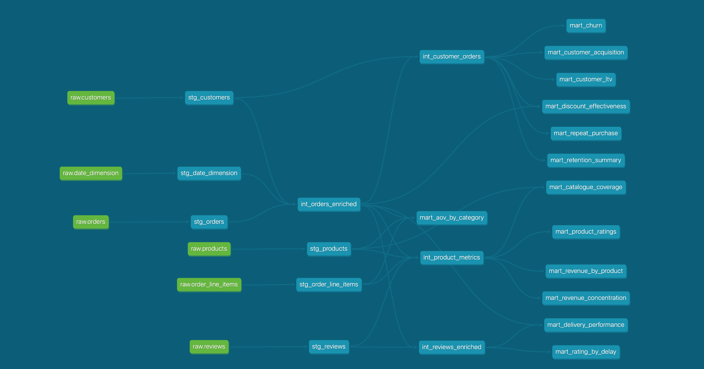

# Retail Analytics Engineering

An end-to-end retail analytics pipeline simulating the data infrastructure of a modern DTC apparel brand — from synthetic data generation to business-ready dashboards.

## The Stack

| Layer | Tool | Purpose |
|---|---|---|
| Data Generation | Python + Faker | Synthetic retail data modeled on Shopify schema |
| Ingestion | dlt | CSV → DuckDB raw schema |
| Storage | DuckDB | Local analytical warehouse |
| Transformation | dbt Core | Staging → Intermediate → Marts |
| Dashboard | Evidence.dev | SQL-first analytics dashboards |

## Project Structure

```
retail-analytics-engineering/
├── data_generation/        # Python scripts to generate synthetic retail data
├── ingestion/              # dlt pipeline to load CSVs into DuckDB
├── dbt_project/            # dbt models — staging, intermediate, marts
│   └── models/
│       ├── staging/        # 6 models — clean and type raw sources
│       ├── intermediate/   # 4 models — joins and business logic
│       └── marts/          # 12 models across 3 domains
│           ├── customer_retention/
│           ├── product_performance/
│           └── fulfillment_experience/
└── evidence-dashboard/     # Evidence.dev dashboard pages
```

## The Data

- 1,000 customers across 10 Canadian provinces
- 2,273 orders over 2 years (2023–2024)
- 5,621 order line items across 60 products in 6 apparel categories
- 900 customer reviews with delivery delay and rating correlation
- 22 dbt models, 110 data tests passing

## Key Findings

- **41% repeat purchase rate** — but declining acquisition suggests reinvestment needed in top-of-funnel
- **Delivery delay drives dissatisfaction** — fast orders average 4.47 stars, delayed orders average 1.79
- **Outerwear drives 30% of revenue** — but top revenue product carries a below-average satisfaction score
- **Discount effectiveness is inconsistent** — no clear evidence discounts build long-term loyalty

## How to Run

### 1. Generate data
```bash
cd data_generation
python3 generate_customers.py
python3 generate_products.py
python3 generate_orders.py
python3 generate_reviews.py
python3 generate_date_dim.py
```

### 2. Ingest into DuckDB
```bash
python3 ingestion/ingest_pipeline.py
```

### 3. Run dbt
```bash
cd dbt_project
dbt run
dbt test
```

### 4. Run dashboard
```bash
cd evidence-dashboard
npm install
npm run sources
npm run dev
```

## Data Model



## Author

Shlok Verma · [LinkedIn](https://linkedin.com/in/shlokverma) · [Portfolio](https://5hlok.com)